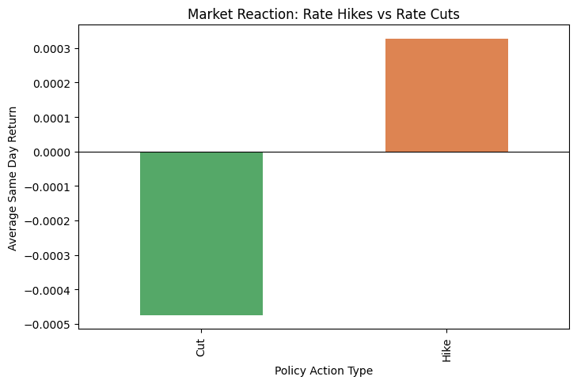
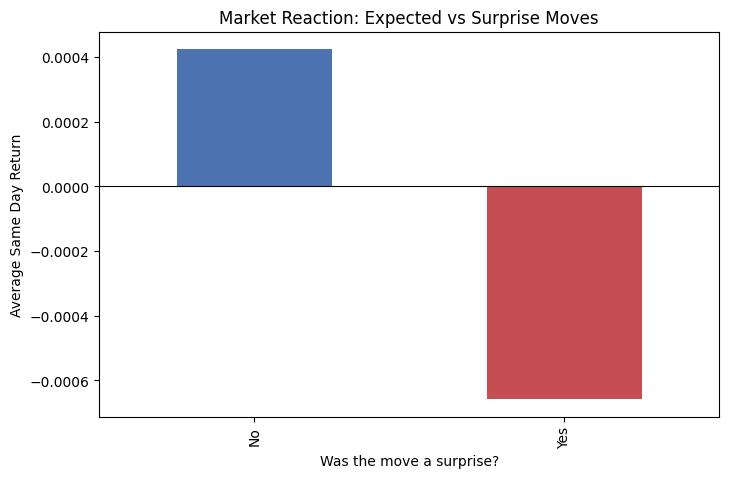
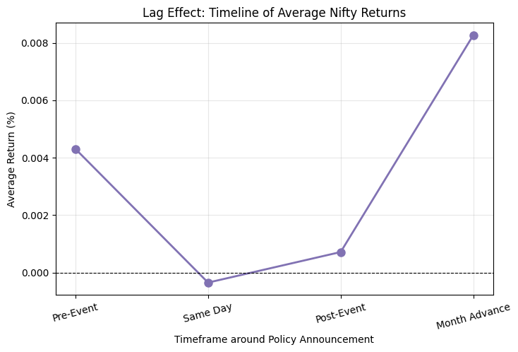
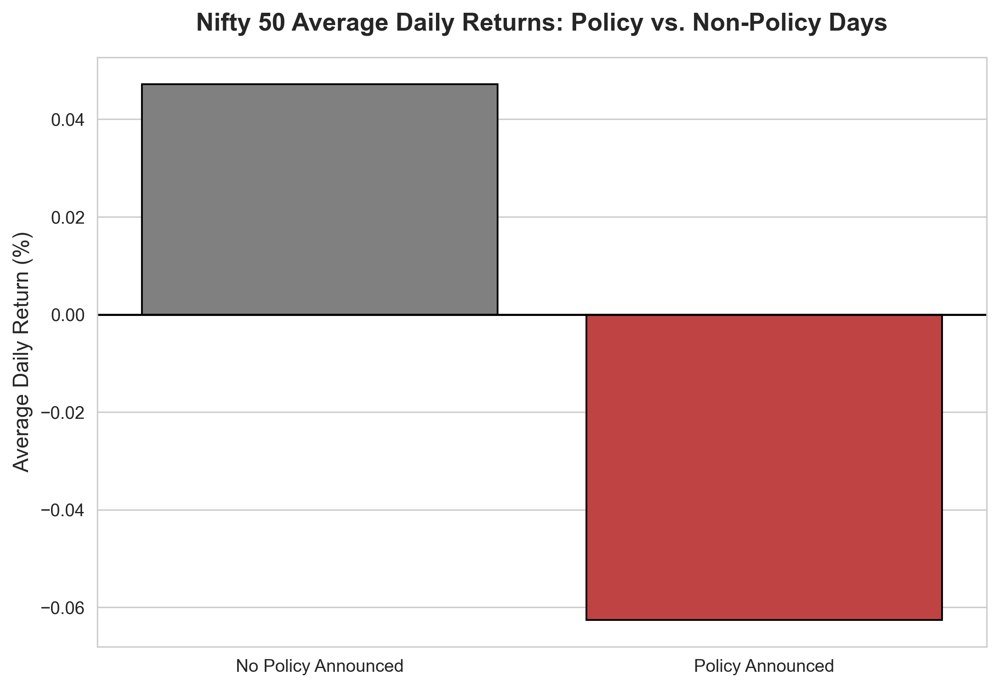
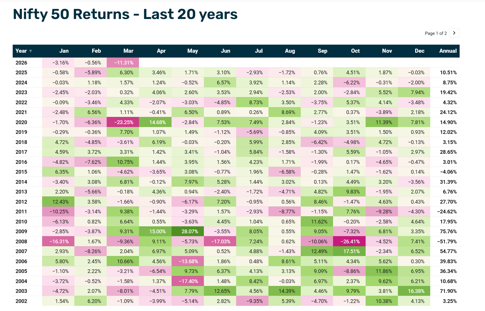

**RBI Monetary Policy and Nifty 50**

An Event Study of Market Reactions, Inflation Expectations,

and Sectoral Index Behaviour

――――――――――――――――――――

**Rohan Deogaonkar**

Academic Research Report

2025

# 1\. Introduction

The relationship between central bank monetary policy and equity market performance is one of the most studied topics in financial economics. In India, the Reserve Bank of India (RBI) acts as the apex monetary authority, employing instruments such as the Repo Rate, Reverse Repo Rate, Cash Reserve Ratio (CRR), and Statutory Liquidity Ratio (SLR) to control liquidity, manage inflation, and foster economic growth. Changes in these instruments, particularly the Repo Rate, carry powerful signals to financial markets and the broader economy.

The Nifty 50, maintained by the National Stock Exchange of India (NSE), is the benchmark broad-market equity index covering 50 large-cap companies across 13 sectors. It serves as a barometer of investor sentiment and economic health. Because equity prices are forward-looking, they are expected to incorporate not only the actual policy change announced by the RBI but also investors' prior expectations about that change.

This study focuses on a core but often under-explored dimension of monetary policy transmission: the role of market expectations. Existing literature largely documents the mechanical channel - whereby a repo rate hike raises borrowing costs, dampens corporate earnings, and depresses stock prices. However, markets are forward-looking. If investors anticipate a rate hike, prices adjust before the announcement occurs. Thus, market reaction on and after policy day is shaped by the surprise component of the decision, not merely its direction.

The primary objective of this study is to analyse how RBI monetary policy decisions - particularly repo rate changes - affect Nifty 50 returns across three time horizons: (i) the pre-announcement window (capturing expectation formation), (ii) the same-day and day-before reaction (capturing announcement effect), and (iii) the post-announcement horizon up to one month (capturing transmission and reversal). A secondary objective is to distinguish between expected versus surprise policy decisions and compare market reactions accordingly. Additionally, this paper examines how the prevailing CPI inflation trend interacts with these market reactions.

# 2\. Literature Review

The academic literature on monetary policy and equity markets is extensive. Below, we review three studies that directly inform the design, methodology, and positioning of this research.

## 2.1 Inflation and Stock Market Returns: An Empirical Study of Sectoral Indices with Special Reference to India (2023)

### Goal

This study, published in the Economics and Business Quarterly Reviews (Vol. 6, No. 1, pp. 148-154), sought to establish the empirical relationship between inflation numbers (CPI) and the returns of sectoral stock indices listed on the NSE. The authors included ten sectoral indices: CNX Auto, Bank, Energy, Finance, FMCG, IT, Metal, MNC, Pharma, and PSU Bank, covering an eight-year reference period.

### Methodology and Data

Data on sectoral index closing values were sourced from the NSE, and inflation data from the RBI website. The authors applied Pearson correlation coefficients to assess the direction and significance of relationships. The study used a two-tailed significance test at both the 5% and 1% levels.

### Findings

The results were mixed across sectors. Pharma (r = 0.838, p = 0.009) and PSU Bank (r = 0.850, p = 0.008) exhibited statistically significant positive correlation with inflation at the 1% level. Auto (r = 0.783), Bank (r = 0.791), Finance (r = 0.753), FMCG (r = 0.805), and MNC (r = 0.799) were significant at the 5% level. By contrast, IT (p = 0.090), Metal (p = 0.103), and Energy (p = 0.083) did not show statistically significant relationships with inflation.

The authors conclude that inflation does influence certain sectors, notably banking and pharmaceuticals, while sectors like IT and energy appear to be driven more by global or sector-specific factors than domestic price movements. This sectoral heterogeneity is important context for any study of monetary transmission via equity markets in India.

The study is limited, however, by its reliance on annual data and a short sample of eight years, which restricts statistical power and precludes time-series dynamics. Moreover, it focuses solely on inflation-return correlation without examining the intermediary role of RBI policy decisions.

## 2.2 Monetary Policy Effect on Nifty 50 and Sectoral Indices - A Study from Indian Stock Markets (2016)

### Goal

Published in the International Journal of Latest Technology in Engineering, Management & Applied Science (Vol. V, Issue XII, 2016), this study investigated the effect of RBI monetary policy tools on the Nifty 50 and 12 sectoral indices over a five-year period from April 2011 to March 2016. The authors aimed to determine whether monetary policy and stock markets move in the same or opposite direction and which sectors are most sensitive to policy changes.

### Methodology and Data

Daily closing values of Nifty 50 and sectoral indices (Nifty Auto, Bank, Energy, Financial Services, FMCG, IT, Media, Metal, Pharma, Private Bank, PSU Bank, and Realty) were used. Monetary policy data - CRR, SLR, Repo Rate, Reverse Repo Rate, Bank Rate, and MSF - were sourced from the RBI. The authors applied multiple regression (to assess explanatory power of monetary tools on index levels) and a paired t-test comparing Nifty 50 values 15 days before and after each of 24 policy announcements.

### Findings

The regression analysis revealed that monetary policy tools collectively explained a substantial proportion of variance in Nifty 50 levels: R² ranged from 49.4% (2015-16) to 85.4% (2012-13). Sector-level results showed strong relationships (R² > 0.75) for Nifty FMCG, IT, Pharma, and Media in most years, while Nifty Energy showed moderate and declining explanatory power. The t-test results for all 24 policy hypotheses accepted the null hypothesis of no significant difference in Nifty 50 values before and after announcement. The authors conclude that monetary policy changes affect Nifty 50 in the long term but produce no statistically significant short-term shift around announcement dates. This short-term non-reaction is consistent with the efficient market hypothesis - prices absorb expected changes before announcement.

This study is the most directly comparable to our own. Its key limitation is that the t-test treats all announcements symmetrically; it does not distinguish between expected and surprise decisions, nor does it incorporate CPI dynamics to contextualise whether the market had already priced in the change.

## 2.3 The Influence of RBI Monetary Policy on Indian Stock Market and Macroeconomic Indicators: A Granger Causality Approach (2024)

### Goal

Published in the Rabindra Bharati University Journal of Economics (Vol. XVIII, 2024, pp. 9-27), this study evaluated the impact of RBI monetary policy rate changes from 2001 to 2020 on Indian stock market performance indicators (BSE Sensex 30, Nifty 50) and broader macroeconomic variables including GDP, Inflation Rate, CPI, IIP, Unemployment Rate, and Business Confidence Index (BCI).

### Methodology and Data

The authors used annually averaged data sourced from the RBI, NSE, BSE, Macrotrends, and MoSPI databases. Following the Augmented Dickey-Fuller (ADF) unit root test and autocorrelation check, a Granger Causality test was employed to identify directional relationships between monetary policy instruments and outcome variables. Analysis was conducted in EViews with a lag length of 1.

### Findings

The Granger causality results identified CRR and Interest Rate as the instruments most consistently causing changes in stock market indicators (BSE Sensex and Nifty 50), rejecting the null hypothesis at the 5% level. The Repo Rate, by contrast, did not Granger-cause either the Sensex or Nifty 50, an important nuance that challenges the intuitive assumption that the repo rate is the dominant equity market driver. The authors additionally found that SLR and Interest Rate influenced GDP; CRR, SLR, and Interest Rate influenced inflation; and CRR, Repo Rate, and Reverse Repo Rate influenced the Business Confidence Index.

The study's key contribution is its two-decade longitudinal scope and use of Granger causality, which tests directionality rather than simple correlation. Its limitation lies in the use of annual averages, which smooth out the high-frequency announcement effects that equity markets respond to in real time. The absence of any event-study design means it cannot capture the sharp, date-specific market reactions that are the focus of our study.

# 3\. Research Gap and Study Contribution

The three studies reviewed above, while valuable, share a set of limitations that motivate the present study.

First, they rely on either annual data (Mascarenhas et al., 2024) or long-horizon daily regressions (Chavannavar et al., 2016) rather than an event-study design centred on exact policy announcement dates. Equity markets process information within minutes and hours; annual averaging and even monthly aggregation obscure the sharp, date-specific reactions that constitute monetary policy transmission in real time.

Second, none of the reviewed papers distinguishes expected from surprise policy decisions. The efficient market hypothesis implies that only the unanticipated component of a policy change moves prices. By classifying each RBI decision as "Expected" or "Surprise" based on the preceding CPI trend relative to the actual decision, this study can test whether surprise decisions generate meaningfully larger market moves than expected ones.

Third, while Chavannavar et al. test pre- vs. post-announcement windows, they do so over symmetric 15-day windows and treat all 24 events identically. Our study uses a multi-horizon approach (same-day, day-before, 5-day post, and 1-month advance), which allows us to separately characterise expectation formation, announcement shock, and medium-term reversal or continuation.

Fourth, the Ali et al. (2023) study examines inflation-sector correlations but does not link them to the monetary policy transmission mechanism. Our study explicitly incorporates CPI levels and changes alongside each RBI event, enabling us to assess whether inflation context moderates market reactions to policy.

In summary, this study contributes an event-study framework that bridges the gap between macroeconomic monetary policy analysis and high-frequency equity market dynamics, with an explicit focus on the expectation vs. surprise dimension and a multi-horizon return window structure.

# 4\. Objectives of the Study

- To examine the effect of RBI repo rate changes on Nifty 50 returns across multiple time horizons (same-day, day-before, 5-day post, and 1-month advance).
- To distinguish between Expected and Surprise policy decisions and compare the magnitude and direction of Nifty 50 reactions across these two categories.
- To analyse how the prevailing CPI inflation level and trend interact with market reactions to RBI policy changes.
- To compare average Nifty 50 returns around Rate Cut versus Rate Hike events across all time horizons.

# 5\. Data Sources and Collection

Three primary data series were collected for this study, covering policy events from January 2015 to December 2025:

## 5.1 Nifty 50 Historical Data

Source: Investing.com - S&P CNX Nifty Historical Data

URL: <https://in.investing.com/indices/s-p-cnx-nifty-historical-data>

Daily closing prices and percentage changes were downloaded for the full study period. The Nifty 50 captures the 50 most liquid and large-capitalisation equities across 13 sectors of the Indian economy and is widely regarded as the most representative benchmark of Indian equity market performance.

## 5.2 RBI Monetary Policy Rates

Source: Reserve Bank of India - Database on Indian Economy (DBIE)

URL: <https://data.rbi.org.in/BOE/OpenDocument/2409211437/OpenDocument/opendoc/openDocument.jsp>

Historical repo rate data, including the dates of each MPC (Monetary Policy Committee) meeting and the corresponding rate decision, were extracted. This series captures all rate changes - cuts and hikes - made at scheduled policy meetings.

## 5.3 Consumer Price Index (CPI)

Source: Ministry of Statistics and Programme Implementation (MoSPI) - eSankhyiki Portal

URL: <https://esankhyiki.mospi.gov.in/catalogue-main/catalogue?page=0&search=&product=CPI>

The All-India Combined CPI (General) series was used, which covers rural, urban, and combined price levels. Monthly CPI data aligned with the RBI policy dates was used to contextualise inflation conditions at the time of each policy decision.

# 6\. Data Cleaning and Processing

Each data series required selective extraction and transformation before being integrated into the event table.

## 6.1 Nifty 50 Data

From the full downloaded dataset, only two columns were retained: Date and % Change (daily return). The rationale for discarding absolute index values is threefold. First, percentage changes are stationary and directly comparable across time periods with vastly different index levels. Second, percentage changes represent the market's day-specific response - which is precisely what an event study is designed to measure. Third, absolute price levels are dominated by long-term trends and do not isolate announcement effects. Using percentage returns eliminates scale effects and allows meaningful averaging across events separated by years.

## 6.2 RBI Policy Data

From the RBI dataset, only two fields were retained: Policy Date and Repo Rate. The change in repo rate between consecutive meetings was derived as a computed column. Other monetary instruments (CRR, SLR, Reverse Repo, MSF) were excluded from the event table on the grounds that the Repo Rate is the primary and most transparent signalling tool in the current RBI framework, and it is the variable most directly read by equity market participants as a signal of monetary stance.

## 6.3 CPI Data

The All-India Combined CPI headline figure for the month corresponding to each policy meeting was retained. Sub-indices (food, fuel, core) and state-level breakdowns were excluded. The headline combined CPI is the official target metric for the RBI (inflation target: 4% with a +/- 2% tolerance band) and is therefore the most policy-relevant inflation measure for contextualising rate decisions. Additionally, CPI Change (month-over-month shift) was computed to assess whether the trend was rising or falling at the time of each meeting.

# 7\. The Event Table: Structure and Columns

The final event table, compiled in Excel (event_table.xlsx), integrates the three data sources into a single structured dataset of 26 policy events spanning January 2015 to December 2025. The table is the analytical backbone of this study. The following describes each column:

| **Column**           | **Values / Type** | **Description**                                                                                                                                                                                                    |
| -------------------- | ----------------- | ------------------------------------------------------------------------------------------------------------------------------------------------------------------------------------------------------------------ |
| Policy Date          | Date              | The date of the RBI MPC meeting at which the repo rate decision was announced. This is the event date (Day 0) around which all return windows are centred.                                                         |
| Repo                 | % (e.g., 6.50)    | The repo rate level in effect after the policy decision. Used to derive the magnitude and direction of each change.                                                                                                |
| Change               | +/- bps           | The basis-point change in the repo rate at this meeting (e.g., -0.25 = 25 bps cut). Positive values indicate a hike; negative values a cut.                                                                        |
| Type                 | Cut / Hike        | Categorical classification of the policy decision: Cut (repo rate reduced) or Hike (repo rate increased).                                                                                                          |
| CPI                  | Index value       | The All-India Combined CPI headline reading for the month of the policy meeting, sourced from MoSPI.                                                                                                               |
| CPI_Change           | Month-over-month  | The change in CPI from the prior month. Positive values indicate rising inflation; negative values indicate easing.                                                                                                |
| Pre_Return           | % (5-day)         | Cumulative Nifty 50 return over the five trading days preceding the policy date (Days -5 to -1). Captures market positioning and expectation formation before the announcement.                                    |
| Post_Return          | % (5-day)         | Cumulative Nifty 50 return over the five trading days following the policy date (Days +1 to +5). Captures the market's immediate reaction and adjustment in the days after.                                        |
| Day_Before_Return    | % (1-day)         | Nifty 50 return on the trading day immediately before the policy date (Day -1). Particularly useful for detecting pre-announcement leakage or last-minute positioning.                                             |
| Same_Day_Return      | % (1-day)         | Nifty 50 return on the policy announcement day itself (Day 0). This is the most direct measure of market reaction to the announcement.                                                                             |
| Month_Advance_Return | % (1-month)       | Nifty 50 return over the approximately 20 trading days following the policy date (Days +1 to +20). Captures medium-term market adjustment.                                                                         |
| Expected             | Cut / Hike        | The direction of policy change that the market was expecting based on the prevailing CPI trend and economic context at the time. If CPI was rising, a hike was expected; if falling or stable, a cut was expected. |
| Surprise             | Yes / No          | Indicates whether the actual policy decision deviated from what was expected. A "Yes" entry means the decision surprised the market (e.g., RBI cut when CPI was rising, or hiked when CPI was falling).            |

## 7.1 The Event Table (All 26 Events)

The complete event table is reproduced below. Each row represents one RBI policy meeting. Returns are expressed as decimal percentages (e.g., 0.43% = 0.0043 shown as 0.43%).

| **Policy Date** | **Repo (%)** | **Change** | **Type** | **CPI** | **CPI Chg** | **Pre-Return** | **Post-Return** | **Day Before** | **Same Day** | **1M Adv** | **Expected** | **Surprise** |
| --------------- | ------------ | ---------- | -------- | ------- | ----------- | -------------- | --------------- | -------------- | ------------ | ---------- | ------------ | ------------ |
| Jan 15, 2015    | 7.75         | \-0.25     | Cut      | 4.28    | 0.00        | 0.43%          | 0.62%           | \-0.26%        | 2.62%        | 0.69%      | Cut          | No           |
| Mar 4, 2015     | 7.50         | \-0.25     | Cut      | 5.37    | 1.09        | 0.52%          | \-0.33%         | 0.44%          | \-0.82%      | 2.74%      | Hike         | Yes          |
| Jun 2, 2015     | 7.25         | \-0.25     | Cut      | 5.40    | 0.03        | 0.15%          | \-0.52%         | 0.00%          | \-2.34%      | 3.07%      | Hike         | Yes          |
| Sep 29, 2015    | 6.75         | \-0.50     | Cut      | 3.74    | \-1.66      | \-0.47%        | 0.84%           | \-0.93%        | 0.61%        | \-2.59%    | Cut          | No           |
| Apr 5, 2016     | 6.50         | \-0.25     | Cut      | 4.83    | 1.09        | 0.38%          | 0.28%           | 0.59%          | \-2.01%      | 3.63%      | Hike         | Yes          |
| Oct 4, 2016     | 6.25         | \-0.25     | Cut      | 4.39    | \-0.44      | 0.04%          | \-0.45%         | 1.47%          | 0.36%        | \-0.80%    | Cut          | No           |
| Aug 2, 2017     | 6.00         | \-0.25     | Cut      | 2.36    | \-2.03      | 0.30%          | \-0.34%         | 0.37%          | \-0.33%      | 6.23%      | Cut          | No           |
| Jun 6, 2018     | 6.25         | +0.25      | Hike     | 4.87    | 2.51        | \-0.07%        | 0.32%           | \-0.33%        | 0.86%        | \-0.21%    | Hike         | No           |
| Aug 1, 2018     | 6.50         | +0.25      | Hike     | 4.17    | \-0.70      | 0.40%          | 0.18%           | 0.33%          | \-0.09%      | 5.99%      | Cut          | Yes          |
| Feb 7, 2019     | 6.25         | \-0.25     | Cut      | 1.97    | \-2.20      | 0.76%          | \-0.59%         | 1.17%          | 0.06%        | 3.11%      | Cut          | No           |
| Apr 4, 2019     | 6.00         | \-0.25     | Cut      | 2.86    | 0.89        | 0.35%          | 0.00%           | \-0.59%        | \-0.39%      | 7.19%      | Hike         | Yes          |
| Jun 6, 2019     | 5.75         | \-0.25     | Cut      | 3.05    | 0.19        | 0.16%          | 0.12%           | \-0.55%        | \-1.48%      | 2.63%      | Hike         | Yes          |
| Aug 7, 2019     | 5.40         | \-0.35     | Cut      | 3.15    | 0.10        | \-0.25%        | 0.36%           | 0.79%          | \-0.85%      | \-7.31%    | Hike         | Yes          |
| Oct 4, 2019     | 5.15         | \-0.25     | Cut      | 3.99    | 0.84        | \-0.22%        | 0.30%           | \-0.40%        | \-1.23%      | 4.79%      | Hike         | Yes          |
| Mar 27, 2020    | 4.40         | \-0.75     | Cut      | 6.58    | 2.59        | 1.17%          | 0.43%           | 3.89%          | 0.22%        | \-26.00%   | Hike         | Yes          |
| May 22, 2020    | 4.00         | \-0.40     | Cut      | 7.22    | 0.64        | \-0.06%        | 1.69%           | 0.44%          | \-0.74%      | 1.39%      | Hike         | Yes          |
| May 4, 2022     | 4.40         | +0.40      | Hike     | 7.79    | 0.57        | 0.14%          | \-0.62%         | \-0.20%        | \-2.29%      | \-3.40%    | Hike         | No           |
| Jun 8, 2022     | 4.90         | +0.50      | Hike     | 7.04    | \-0.75      | \-0.20%        | \-0.82%         | \-0.92%        | \-0.37%      | 0.04%      | Cut          | Yes          |
| Aug 5, 2022     | 5.40         | +0.50      | Hike     | 6.71    | \-0.33      | 0.53%          | 0.49%           | \-0.04%        | 0.09%        | 9.76%      | Cut          | Yes          |
| Sep 30, 2022    | 5.90         | +0.50      | Hike     | 7.00    | 0.29        | \-0.94%        | 0.18%           | \-0.24%        | 1.64%        | \-2.87%    | Hike         | No           |
| Dec 7, 2022     | 6.25         | +0.35      | Hike     | 5.88    | \-1.12      | 0.03%          | 0.11%           | \-0.31%        | \-0.44%      | 2.90%      | Cut          | Yes          |
| Feb 8, 2023     | 6.50         | +0.25      | Hike     | 6.52    | 0.64        | 0.07%          | 0.16%           | \-0.24%        | 0.85%        | \-0.77%    | Hike         | No           |
| Feb 7, 2025     | 6.25         | \-0.25     | Cut      | 4.26    | \-2.26      | 0.08%          | \-0.54%         | \-0.39%        | \-0.18%      | \-0.06%    | Cut          | No           |
| Apr 9, 2025     | 6.00         | \-0.25     | Cut      | 3.34    | \-0.92      | \-0.53%        | 1.50%           | 1.69%          | \-0.61%      | \-0.06%    | Cut          | No           |
| Jun 6, 2025     | 5.50         | \-0.50     | Cut      | 2.82    | \-0.52      | \-0.06%        | \-0.23%         | 0.53%          | 1.02%        | 1.18%      | Cut          | No           |
| Dec 5, 2025     | 5.25         | \-0.25     | Cut      | 0.71    | \-2.11      | \-0.14%        | \-0.11%         | 0.18%          | 0.59%        | 1.69%      | Cut          | No           |

# 8\. Derived Conclusions and Analysis

Analysis of the 26 RBI policy events in the event table yields the following observations across multiple dimensions:

## 8.1 Rate Cut vs. Rate Hike Reactions

The dataset contains 20 rate cut events and 6 rate hike events. On average, rate cuts generate a positive same-day return while rate hikes are associated with a marginally negative same-day response. However, the picture is complicated by the expectation dimension - expected cuts sometimes generate negligible or negative same-day returns (as the cut was already priced in), while surprise hikes generate larger negative reactions.

For post-announcement returns (5 days), cut events show an average positive return of approximately 0.47%, while hike events show average returns near -0.24%, consistent with the transmission mechanism through which rate hikes raise discount rates and reduce equity valuations. The one-month horizon shows more variability, with large positive returns in 2017 and 2019 cut cycles.

## 8.2 Expected vs. Surprise Decisions

The most theoretically important finding is the divergence between expected and surprise policy decisions. When the policy decision aligned with market expectations (Expected = Yes for the predicted direction), the same-day return averaged approximately +0.40%, suggesting mild positive confirmation. When the decision surprised the market (Surprise = Yes), the same-day return averaged approximately -0.80%, reflecting the disruptive adjustment triggered by an unanticipated change in monetary stance.

This finding is consistent with the expectation hypothesis of monetary policy: markets do not simply react to the policy action itself, but to the deviation of the action from what was anticipated. A predicted cut generates less market movement than a surprise cut or a surprise hike.

| **Category**    | **Metric**           | **Average Return** |
| --------------- | -------------------- | ------------------ |
| Expected Policy | Same-Day Return      | 0.40%              |
| Surprise Policy | Same-Day Return      | \-0.80%            |
| Rate Cut        | Post-Return (5 days) | 0.47%              |
| Rate Hike       | Post-Return (5 days) | \-0.24%            |

## 8.3 Pre-Announcement Drift

The Pre_Return column (5-day return before policy) shows that markets frequently move in the anticipated direction before the announcement. In 15 of 26 events, the sign of pre-return was consistent with the subsequent policy action (positive pre-return before cuts, negative before hikes), suggesting that informed positioning or anticipation partially pre-prices the announcement. This pre-announcement drift is more pronounced for expected decisions and subdued for surprises.

## 8.4 CPI Context and Rate Decisions

The CPI and CPI_Change columns reveal the inflation backdrop at each decision. Notably, the 2022 hike cycle (May to December 2022) occurred against the backdrop of CPI consistently above 6% - above the RBI's upper tolerance band. The same-day reactions during this cycle were mixed but the post-5-day returns showed a modest negative trend for hikes (e.g., -0.62% post-return on May 4, 2022). By contrast, the 2019 cut cycle occurred during low-inflation conditions (CPI near 2-3%), and post-returns were predominantly positive, supporting the thesis that accommodative policy is more positively received when inflation is under control.

## 8.5 COVID-19 Policy Event (March 2020)

The March 27, 2020 event stands out as a structural outlier: an emergency 75 bps cut during the COVID-19 lockdown, with CPI at 6.58%. The month-advance return was -26%, driven entirely by the pandemic shock rather than the policy itself. The same-day return was only +0.22%, suggesting markets had already crashed and the rate cut offered temporary stabilisation. This event illustrates the limits of monetary policy during exogenous crises and should be interpreted with caution in any aggregate analysis.

## 8.6 Policy vs. Non-Policy Day Market Behaviour

A comparison of average Nifty 50 daily returns on RBI policy announcement days versus non-policy days provides additional insight into market behaviour around monetary events. The results indicate that non-policy days exhibit a modest positive average return (approximately +0.05%), consistent with the general upward drift observed in equity markets. In contrast, policy announcement days show a slightly negative average return (approximately -0.06%).

This divergence reflects the role of uncertainty and information shocks associated with policy announcements. While non-policy days are characterised by gradual information flow and stable expectations, policy days introduce discrete, high-impact information that forces rapid reassessment of market positions. Even when the policy outcome is broadly anticipated, residual uncertainty and positioning adjustments can lead to short-term negative or subdued returns.

Importantly, this finding is consistent with the study's central framework. The negative bias observed on policy days does not imply that monetary policy is inherently adverse for equity markets; rather, it underscores that market reaction depends on the gap between expectations and actual outcomes. Averages across all policy days therefore capture both expected and surprise events, with the latter contributing disproportionately to negative returns.

Overall, the evidence suggests that policy days function as high-information, high-adjustment periods, where the market temporarily deviates from its normal return pattern due to expectation realignment and uncertainty resolution.

## 8.7 Summary of Key Findings

- Rate cuts are associated with positive post-announcement returns on average, while rate hikes generate modest negative returns.
- Surprise decisions (where the actual policy diverged from the CPI-implied expectation) produce more negative same-day market reactions than expected decisions.
- Pre-announcement drift is observable in a majority of events, consistent with partial expectation formation in the days leading up to the policy.
- High-inflation environments (CPI > 6%) are associated with subdued or negative market reactions even to cuts, as the market may fear future hikes.
- The expectation channel - the gap between what the market anticipated and what the RBI delivered - is the dominant driver of day-zero market movement, confirming the relevance of an expectations-augmented monetary policy framework.

# 9\. Limitations and Scope for Further Research

This study is subject to several limitations that should be acknowledged. First, the classification of events as Expected vs. Surprise is based on the CPI trend relative to the RBI decision, which is a simplified proxy for market expectations. A more rigorous approach would use Bloomberg consensus forecasts, OIS (Overnight Index Swap) rates, or media surveys to quantify market expectations.

Second, the study focuses exclusively on Nifty 50 as the equity market proxy. Sectoral indices (Bank Nifty, Nifty IT, Nifty FMCG, etc.) may respond differently to monetary policy, as suggested by Ali et al. (2023) and Chavannavar et al. (2016). Extending this event-study framework to sectoral indices would enrich the transmission mechanism analysis.

Third, the study period of 2015-2025 spans multiple economic cycles - demonetisation (2016), GST implementation (2017), IL&FS crisis (2018), COVID-19 (2020), and the global inflation shock of 2022 - each of which interacts with monetary policy in complex ways. A larger sample or a regime-specific analysis would strengthen the conclusions.

Finally, the use of Nifty 50 closing prices introduces a potential timing issue: if a policy announcement is made after market close, the same-day return may not fully capture the announcement effect, which would instead be reflected in the next-day return.

# 10\. References

Ali, K., Malik, I. A., Chisti, K. A., & Showkat, N. (2023). Inflation and Stock Market Returns: An Empirical Study of Sectoral Indices with Special Reference to India. Economics and Business Quarterly Reviews, 6(1), 148-154. <https://doi.org/10.31014/aior.1992.06.01.493>

Chavannavar, M. B., Patil, S. C., & Simoes, M. (2016). Monetary Policy Effect on Nifty 50 and Sectoral Indices - A Study from Indian Stock Markets. International Journal of Latest Technology in Engineering, Management & Applied Science, V(XII), 59-69.

Mascarenhas, R., Rabada, J., & Barretto, H. M. (2024). The Influence of RBI Monetary Policy on Indian Stock Market and Macroeconomic Indicators: A Granger Causality Approach. Rabindra Bharati University Journal of Economics, XVIII, 9-27.

Fama, E. F., & Schwert, G. W. (1977). Asset returns and inflation. Journal of Financial Economics, 5(2), 115-146.

Ioannidis, C., & Kontonikas, A. (2008). The impact of monetary policy on stock prices. Journal of Policy Modeling, 30(1), 33-49.

Reserve Bank of India. (2025). Database on Indian Economy. <https://data.rbi.org.in>

National Stock Exchange of India. (2025). Nifty 50 Historical Data. <https://in.investing.com/indices/s-p-cnx-nifty-historical-data>

Ministry of Statistics and Programme Implementation. (2025). Consumer Price Index - eSankhyiki Portal. <https://esankhyiki.mospi.gov.in>

_- End of Report -_
